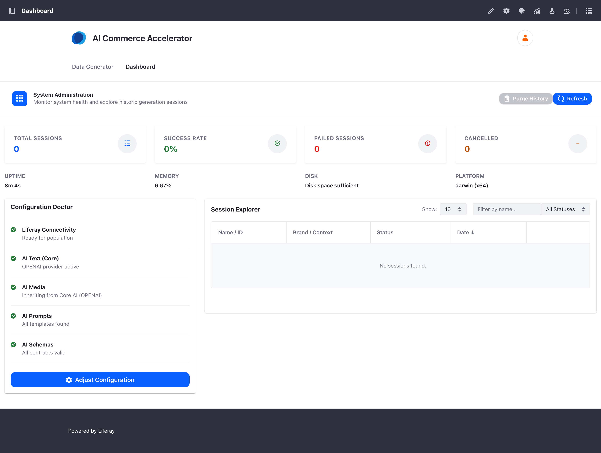
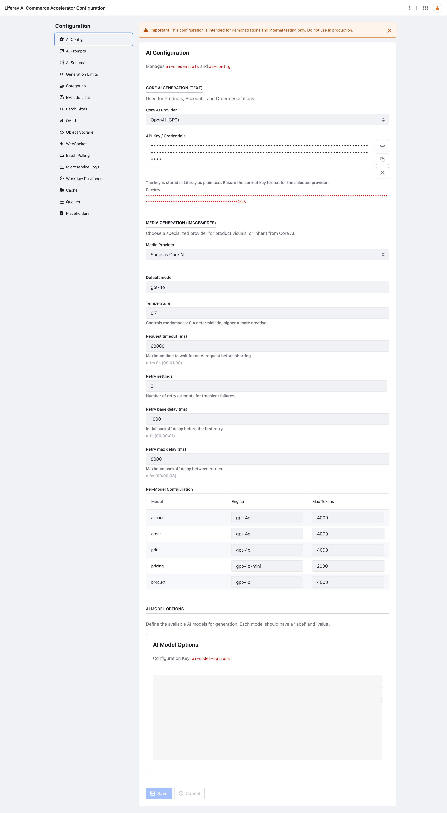

# Liferay AI Commerce Accelerator

Empowering Liferay Commerce with high-integrity, AI-orchestrated data.

[](https://github.com/peterrichards-lr/liferay-ai-commerce-accelerator/actions/workflows/ci.yml)
[](https://opensource.org/licenses/MIT)

The **Liferay AI Commerce Accelerator (AICA)** is a production-ready suite of client extensions designed to rapidly generate and deploy sophisticated commerce data into Liferay DXP using generative AI. It eliminates the manual effort of populating catalogs, accounts, and orders, allowing teams to focus on building and testing features.

---

## ⚡ 1-Minute Quick Start (LDM)

If you are a Sales Engineer or developer using Liferay Docker Manager (LDM), you can import a fully-populated demonstration environment with a single command:

```bash
ldm import https://github.com/peterrichards-lr/liferay-ai-commerce-accelerator
```

For manual developer setup, prerequisites, and instructions, please read our **[Quick Start Guide](./docs/QUICKSTART.md)**.

---

## 📚 Documentation Directory

Our official documentation is kept clean and user-focused:

- **[Quick Start Guide](./docs/QUICKSTART.md)**: Full instructions for manual installation, running the microservices, and automated testing.
- **[Architectural Overview](./docs/ARCHITECTURE.md)**: Deep dive into the stateful workflow engine and system map.
- **[Features & Capabilities](./docs/FEATURES.md)**: Details on AI generation, real-time monitoring, and visual assets.
- **[Liferay MCP Server](./docs/MCP.md)**: Documentation on connecting the accelerator's Model Context Protocol (MCP) server to AI agents.
- **[JSON Web Services Guide](./docs/JSONWS_GUIDE.md)**: Guide on configuring Liferay's API authentication.
- **[Automation Playbook](./docs/PLAYBOOK.md)**: The rules, workflows, and issue templates driving the AI-assisted development of this repository.

_(Note: If you see folders like `conductor/`, `jira/`, or `internal/` in the repository, they contain internal tracking state and upstream bug reports meant for the project maintainers and AI agents. You do not need to read them)._

---

## 💻 Native CLI Command Suite (`aica`)

AICA features a zero-dependency, native headless command line interface **`aica`** to automate catalog seeding, teardowns, and dataset migrations directly from your scripts or CI/CD pipelines:

```bash
# Verify connection to local microservice and handshake with DXP
aica connect

# Seed a demo catalog of 10 Products, 10 B2B Accounts, and 50 Orders in <2 minutes!
aica generate --demo --products 10 --accounts 10 --orders 50

# Retrieve and pretty-print the current active configuration parameters
aica config get

# Set a single configuration parameter dynamically
aica config set --key liferayUrl --value "https://my-custom-dxp.com"

# Export a completed generation dataset to JSON for portability
aica export AICA-SESSION-12345 ./my-saved-dataset.json

# Import and re-scaffold a saved dataset on a new Liferay DXP instance in <1 minute!
aica import ./my-saved-dataset.json

# Wipe all generated commerce entities globally, leaving Liferay perfectly clean
aica delete --all
```

---

## 🖼️ User Interface & Visual Experience

AICA features a beautifully designed, modern, and data-dense user interface inside Liferay DXP. Below are visual previews of the client extension views:

### 1. AI Data Generator (Populating the Catalog)

_Seed comprehensive commerce catalogs, pricing structures, and media assets in under 2 minutes._


### 2. Live Monitoring & Session Administration Dashboard

_Monitor active generation steps in real-time via WebSockets with detailed progress gauges, stats hydration, and logs analysis._


### 3. Client Extension System Configuration

_Configure AI provider keys, API endpoints, and DXP connectivity parameters dynamically directly in Liferay's Control Panel._


---

## ✨ Core Pillars

- **Intelligent Orchestration**: A stateful microservice manages complex entity dependencies, ensuring 100% data integrity even across server restarts.
- **Zero-Cost Mock AI Sandbox**: Develop E2E workflows at exactly $0.00 cost by using `GEMINI_API_KEY="mock-sandbox"`.
- **Pre-flight Token Safety Guardrail**: Integrates a local, zero-dependency token count estimator that blocks oversized requests (>15,000 tokens) from draining your billing quotas.
- **Provider Agnostic**: Switch between OpenAI, Google Gemini, and Anthropic Claude with zero code changes.

<!-- markdownlint-disable MD049 -->

---

_Last Updated: 2026-07-07_ | _Last Reviewed: 2026-07-07_
