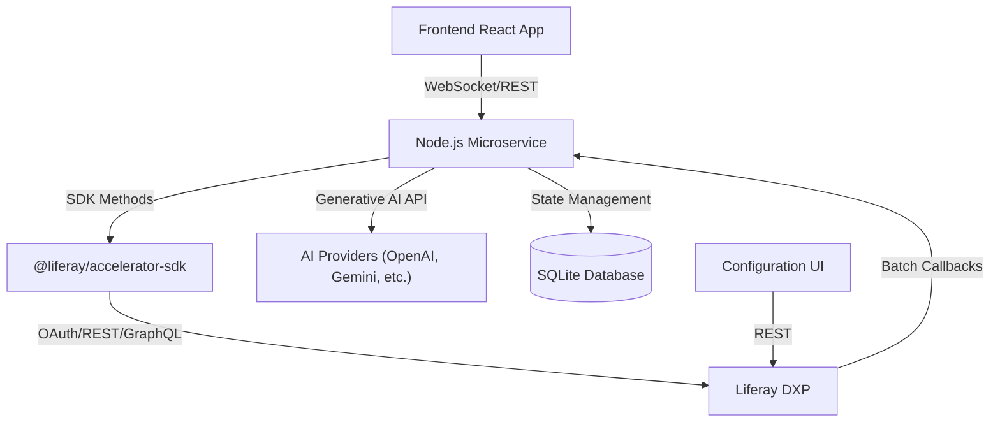
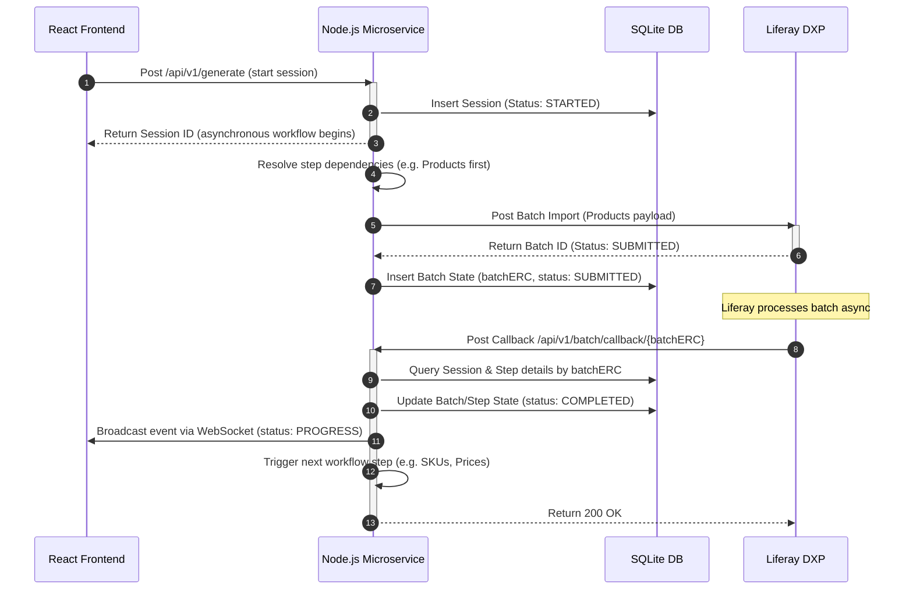
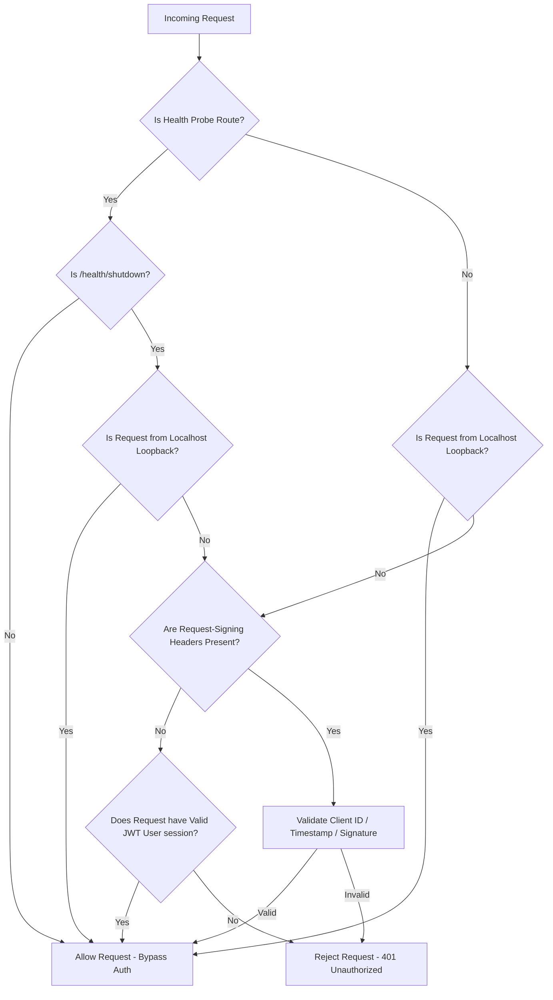
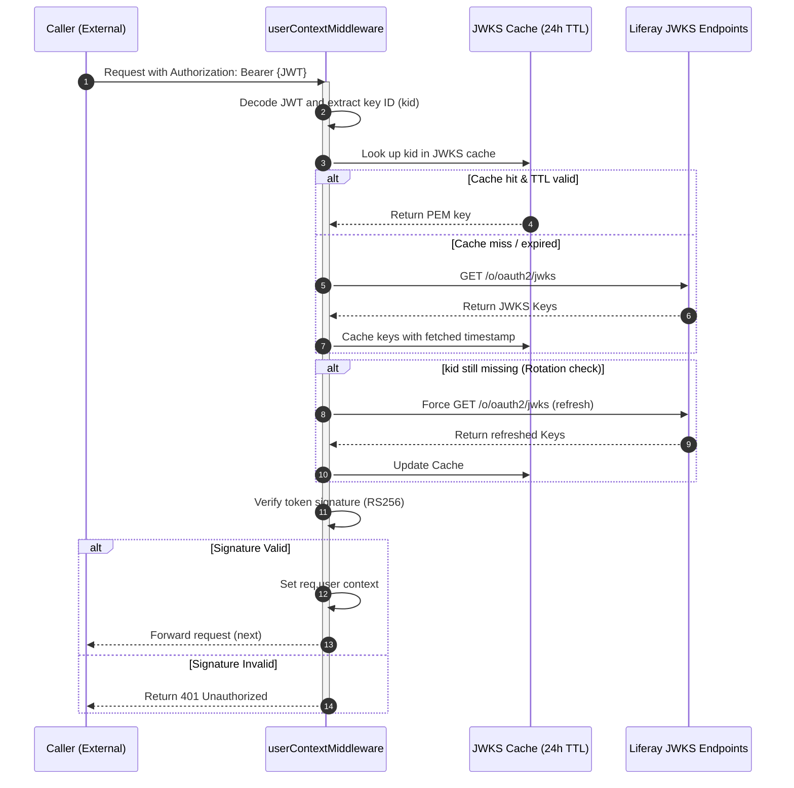

# Architectural Overview

The Liferay AI Commerce Accelerator employs a sophisticated, stateful, and asynchronous architecture to manage the creation of large amounts of commerce data.

## System Map



## System Modularization

To ensure scalability and reusability, the Liferay integration logic is isolated into its own dedicated repository: **`@liferay/accelerator-sdk`** (hosted at `https://github.com/peterrichards-lr/liferay-accelerator-sdk`).

- **Liferay Protocol Layer (SDK)**: Extracted into a standalone repository and imported as a private Git dependency in `package.json`. It handles OAuth2 token management, automatic retries with exponential backoff, dynamic capability detection (PIM vs. Legacy Commerce adapters), and fluent API access (REST, GraphQL, Batch).
- **Domain Orchestration Layer (Microservice)**: Contains the specific commerce logic, data generators, and state management for complex multi-step workflows.

## Data Generation Workflow

At its core, the system is a state machine orchestrated by `batchCallbackService.cjs`.

- **Stateful Workflow Engine**: Uses a local **SQLite** database (`workflows.db`) to track the state of every generation job. This makes the process resilient to server restarts.
- **Asynchronous Batch Processing**: Designed around the limitations of Liferay's Headless Batch APIs.
  1.  **Stateless Callbacks**: Liferay's batch engine callback does not contain context about the original request.
  2.  **`batchERC` for Correlation**: The microservice generates a unique identifier (`batchERC`) for each batch. This ERC is appended to the callback URL.
  3.  **State Lookup**: When Liferay calls the callback endpoint, the service uses the `batchERC` to resume the correct workflow.

### Entity Dependencies

When creating entities with parent-child relationships (like Accounts and their Addresses), the workflow follows a multi-step process:

1.  Submit a batch to create parent entities.
2.  Wait for completion.
3.  Fetch new parent entities to retrieve system-generated IDs.
4.  Submit a new batch for child entities with the necessary parent IDs.

### Batch Statuses

- **`PREPARED`**: Created in local DB, not yet submitted to Liferay.
- **`SUBMITTED`**: Sent to Liferay, waiting for callback.
- **`COMPLETED`**: Liferay finished processing with no errors.
- **`FAILED`**: Liferay encountered an error.
- **`BYPASSED`**: Step skipped due to logic or configuration.
- **`SYNCHRONOUS`**: Internal microservice logic or synchronous API calls.

## WebSocket Event Contract

The microservice and frontend communicate using a hierarchical **Scope/Status** model.

### Event Structure (JSON)

```json
{
  "type": "STARTED | PROGRESS | COMPLETED | FAILED",
  "scope": "session | step | batch",
  "entityType": "products | accounts | orders | warehouses | images | pdfs",
  "operation": "generate | delete | process-images | process-attachments",
  "processedCount": 50,
  "totalCount": 100,
  "correlationId": "CID-789"
}
```

### Critical Sync Rule

Any change to the event emission logic in `ProgressService.cjs` MUST be matched by a corresponding update in the frontend `progressReducer.js`.

## Elasticsearch Indexing Latency and Client-Side Resilience

During the development of AICA, we identified and documented a platform-wide race condition (registered as JIRA **LPD-95082**) where subsequent automated list or GraphQL queries executed immediately after successful entity creation (e.g. Products or SKUs) fail to retrieve the new entities.

### 🔍 The Core Platform Constraint

Liferay's Headless list and GraphQL APIs query the search index (Elasticsearch) by design rather than hitting the relational database directly. Because Liferay's Batch Engine indexes records **asynchronously**—dispatching indexing tasks to a background queue that completes only after thread/transaction execution finishes—there is a latency window (typically 1 to 15 seconds depending on system load) where newly persisted entities exist in the database but are invisible to search queries.

### ❌ Bypassed Platform-Side Workarounds

Liferay's core product team proposed two platform-side configuration changes, which we evaluated and **rejected** for the following architectural reasons:

1.  **Setting `IndexerRegistryConfiguration.buffered = false`:** This forces Liferay's indexer registry to bypass the background queue and synchronously refresh Elasticsearch on every write.
    - _Why Rejected:_ Bypassing indexing buffers severely degrades DXP's write performance, leading to HTTP thread pool exhaustion during bulk seeder operations. Furthermore, this is a global, portal-level system setting that is strictly restricted and blocked by Cloud Operations in managed **Liferay Experience Cloud (SaaS)** environments.
2.  **Introducing a programmatic "Creation ➔ Reindex ➔ Batch Discovery" workflow:** This triggers a search reindex job programmatically after each creation phase before querying.
    - _Why Rejected:_ Triggering site-scoped reindexing takes minutes to complete. Inserting this step between our nested generation phases (e.g., after creating Products, SKUs, and Prices) would spike the Liferay JVM CPU/IO and inflate our seeding execution time from **2 minutes to over 30 minutes**, destroying the fast demo experience.

### 🛡️ AICA's Zero-Configuration, SaaS-Native Solution

To ensure AICA is completely plug-and-play on any vanilla, local, or managed SaaS Liferay environment without requiring system-level configuration changes or degrading index performance, we engineered a **Dual-Layer Client-Side Resilience Engine**:

- **Layer 1 (Exponential Backoff Retries):** The SDK rest client includes an exponential backoff retry loop (`resolveByERCsWithRetry` over 8 cycles/3 minutes) that safely waits for Liferay's async indexing background thread to finish, absorbing indexing latency under moderate loads.
- **Layer 2 (Local In-Memory Fallbacks):** During heavy, high-volume generation pipelines, AICA completely decouples itself from the search index. The Node.js seeder caches newly created variant schemas in-memory and performs a local **context-merge**. When downstream steps (like the Order Generator) require SKUs, AICA reads them directly from local Node.js memory instead of waiting for the search index to populate, completely immunizing the seeder against search latency.

### 🔄 Programmatic Search Reindexing

To resolve long-term indexing synchronization issues and eliminate search lag for storefront inspection, AICA integrates a programmatic search reindexing trigger executed at session boundaries:

- **Option 1: JAX-RS REST Endpoint (`/o/aica-reindex`)**: A lightweight Java OSGi module (`modules/aica-reindex-endpoint`) deployed to Liferay DXP that exposes a secure REST API `/o/aica-reindex/reindex/{className}` (restricted to Omniadmins). This is facaded by the JS SDK (`triggerReindex()`) and automatically invoked:
  - **Post-Seeding / Import**: Automatically triggers a targeted reindex for Commerce Products (`com.liferay.commerce.product.model.CPDefinition`) when a generation or dataset import workflow successfully completes.
  - **Post-Deletion**: Triggers a global search reindex at the end of the `delete --all` teardown flow to purge any stale, lingering entries from Elasticsearch.
- **Option 2: LDM Runtime Trigger (`ldm reindex`)**: LDM implements an immediate reindexing controller. If LDM detects the container is active, it routes a script directly to the JVM via the Gogo telnet console (`11311`) to execute immediate reindexing at the runtime layer, falling back to boot-time scheduling if offline.

## Detailed Security & Execution Flows

### 1. Asynchronous Batch Callback & State Machine Flow



### 2. Request Signing & JWKS Verification Flow





### 3. CI/CD Quality Gates & DevSecOps Pipeline


<!-- markdownlint-disable MD049 -->

---

_Last Updated: 2026-07-09_ | _Last Reviewed: 2026-07-09_
