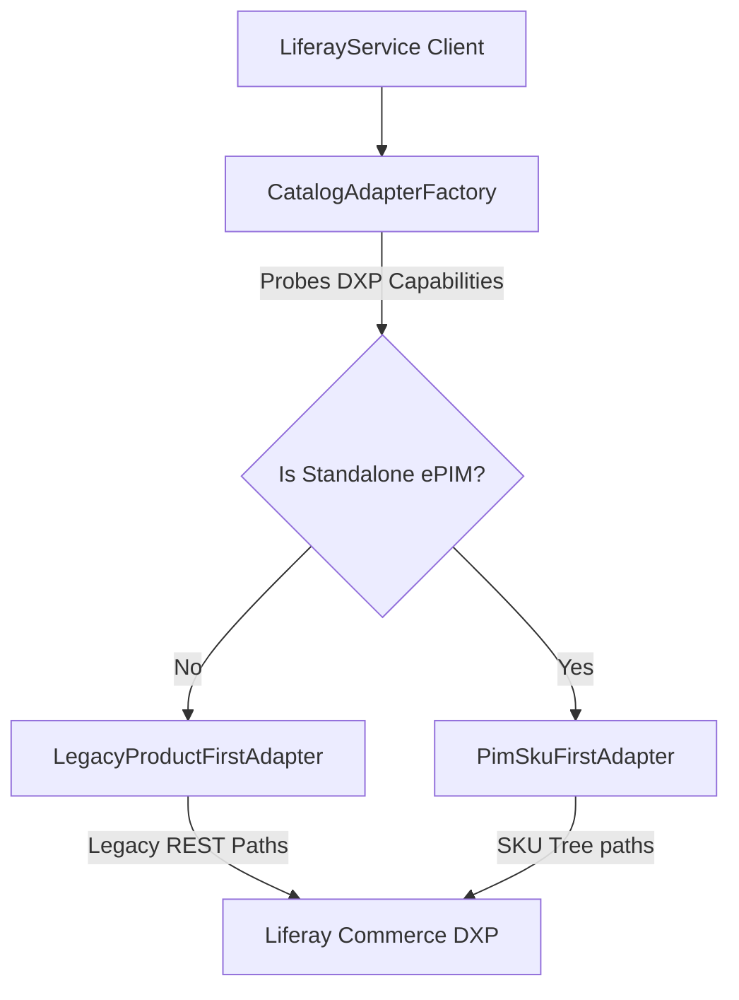

# Architectural Blueprint: Liferay Development Kit (LDK)

The Liferay Development Kit (LDK) is the decoupled, standalone `@liferay/accelerator-sdk` repository. It serves as the unified, reusable integration layer for Node-based Liferay Client Extensions (CX) and automations.

Repository: `https://github.com/peterrichards-lr/liferay-accelerator-sdk`

---

## 1. Vision & Core Principles

### Decoupled Core vs. Namespaced Features

Instead of maintaining domain-specific SDKs, the LDK combines shared networking plumbing (OAuth, rate-limiting, retries, and contract validations) with modular, namespaced domain services:

```text
                               ┌────────────────────────┐
                               │   LDK Client Instance  │
                               └───────────┬────────────┘
                                           │
                  ┌────────────────────────┼────────────────────────┐
                  ▼                        ▼                        ▼
       .commerce Namespace      .platform Namespace      .objects Namespace
       ┌───────────────────┐    ┌───────────────────┐    ┌───────────────────┐
       │ - Price Lists     │    │ - Users & Roles   │    │ - Generic CRUD    │
       │ - SKU Variants    │    │ - Sites & Pages   │    │   for any Custom  │
       │ - Orders          │    │ - Doc Library     │    │   Liferay Object  │
       └───────────────────┘    └───────────────────┘    └───────────────────┘
```

### Agentic-Friendly by Design

To enable AI agents (and human developers) to use the LDK intuitively, the library enforces strict API predictability:

1. **Deterministic Signatures**: All write and read operations across all namespaces strictly adhere to: `method(config, payload, options)`.
2. **Strict Typing & Self-Discovery**: Every function is fully documented with complete JSDoc annotations to enable IDE auto-completion.
3. **Idempotency-by-Default**: Every write operation (e.g., creating a site, user, or price list) performs an internal check and auto-converts to an update (`PATCH` / `PUT`) if the entity already exists.
4. **Resilience Policies**: Configurable exponential backoff retries (`LIFERAY_API_MAX_RETRIES`) and soft-status error resolution mapping (`SOFT_STATUS_BY_OP`).

---

## 2. Dynamic Catalog Adapter Layer

A key feature of the LDK is the ability to adapt dynamically to the target Liferay portal configuration. Liferay Commerce APIs diverge between legacy Commerce (Product-first) and standalone Liferay PIM (SKU-first tree) models.

The LDK shields consumers from these variations through the **Catalog Adapter Layer**:



- **LiferayCatalogAdapter**: Defines the base abstract interface for catalog and pricing operations.
- **LegacyProductFirstAdapter**: Maps calls to standard Liferay Commerce REST/GraphQL endpoints.
- **CatalogAdapterFactory**: Runs a dynamic capability probe at startup to discover if the target portal instance has standalone PIM features active, auto-instantiating the correct adapter.

---

## 3. Monorepo Integration Pattern

To pull the private SDK into the Commerce Accelerator monorepo, the package is integrated as a Git dependency.

### Dependency Configuration

In `client-extensions/ai-commerce-accelerator-microservice/package.json`:

```json
"dependencies": {
  "@liferay/accelerator-sdk": "git+https://github.com/peterrichards-lr/liferay-accelerator-sdk.git#main"
}
```

### Dynamic Schema Alignment

Since the SDK is located inside `node_modules`, static file-path resolvers are replaced with dynamic Node.js resolution:

```javascript
const sdkPkgPath = require.resolve('@liferay/accelerator-sdk/package.json');
const apiSchemasDir = path.join(path.dirname(sdkPkgPath), 'api-schemas');
```

---

## 4. Development & Release Cycle

1. **Local Modifying**: Developers should clone the SDK repository separately to make changes.
2. **Testing**: Run `yarn test` in the SDK repository to execute local Vitest suites.
3. **Integration**: Update the target commit/branch tag in the monorepo's `package.json` to lock down version releases.

<!-- markdownlint-disable MD049 -->

---

_Last Updated: 2026-07-02_ | _Last Reviewed: 2026-07-02_

<!-- markdownlint-disable MD049 -->

---

_Last Updated: 2026-07-08_ | _Last Reviewed: 2026-07-08_

<!-- markdownlint-disable MD049 -->

---

_Last Updated: 2026-07-08_ | _Last Reviewed: 2026-07-08_
