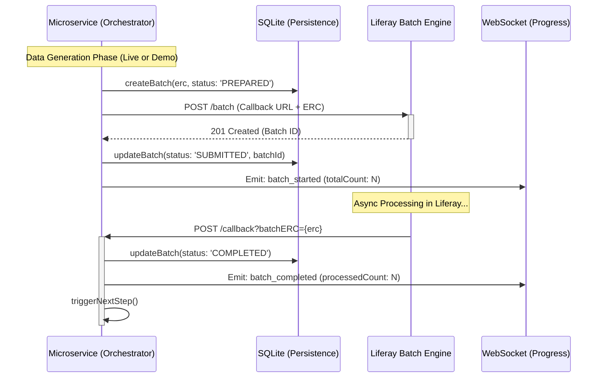
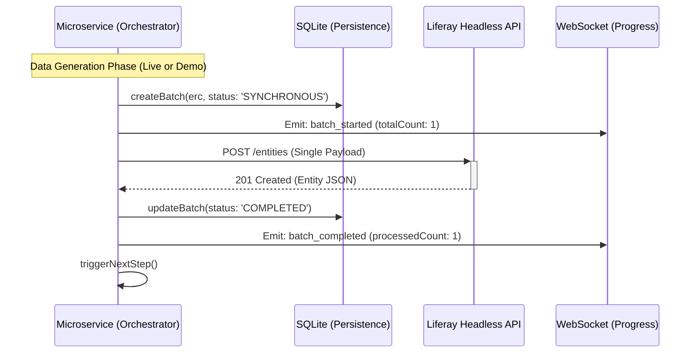
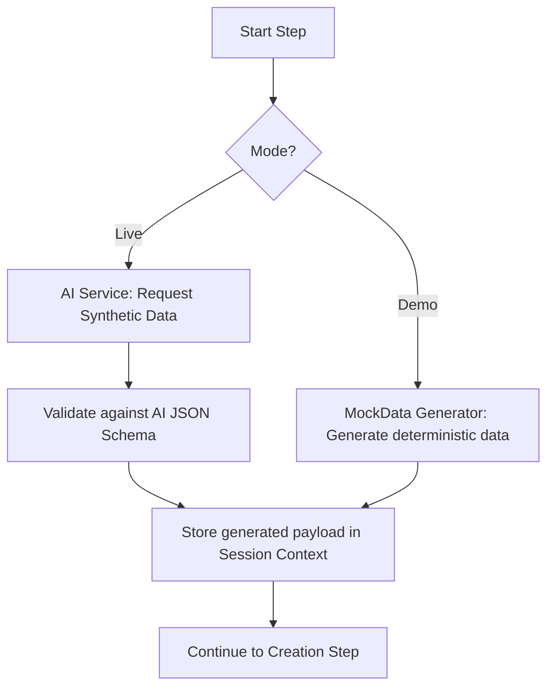
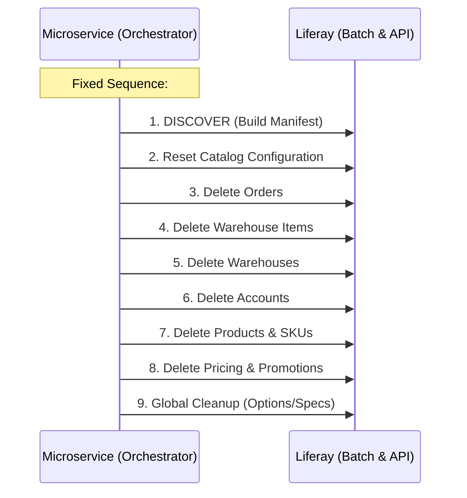
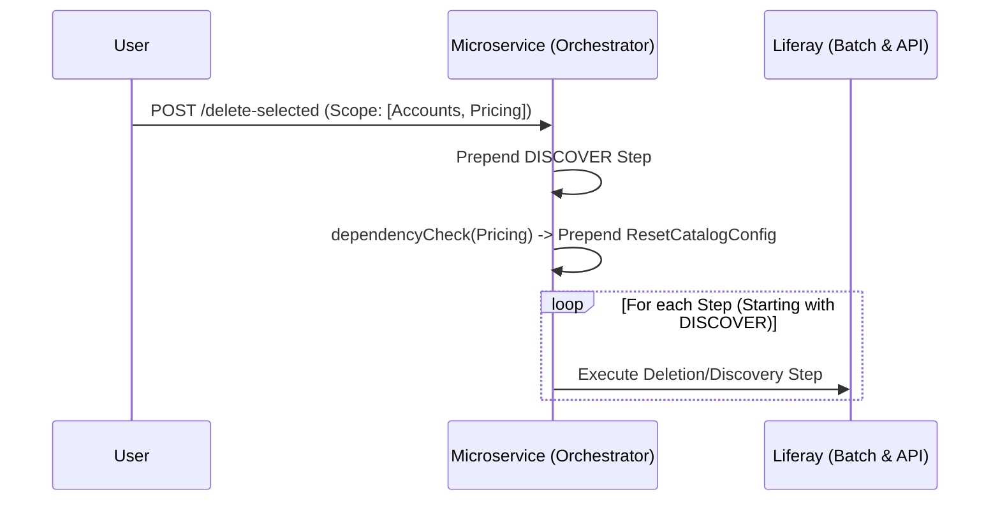
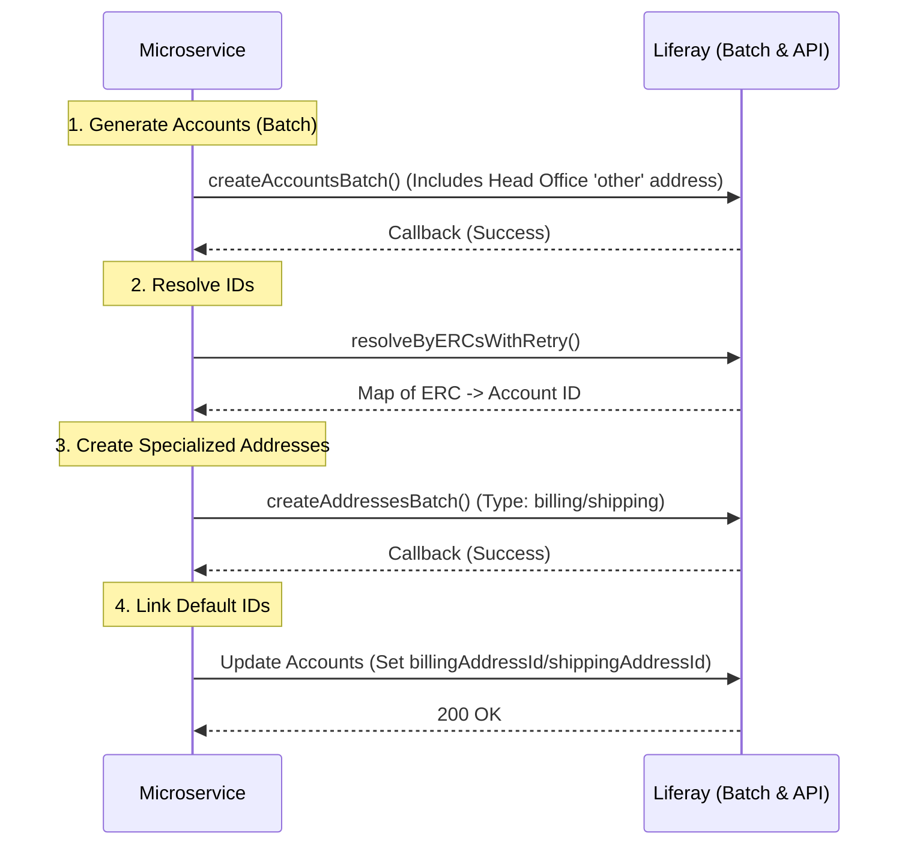
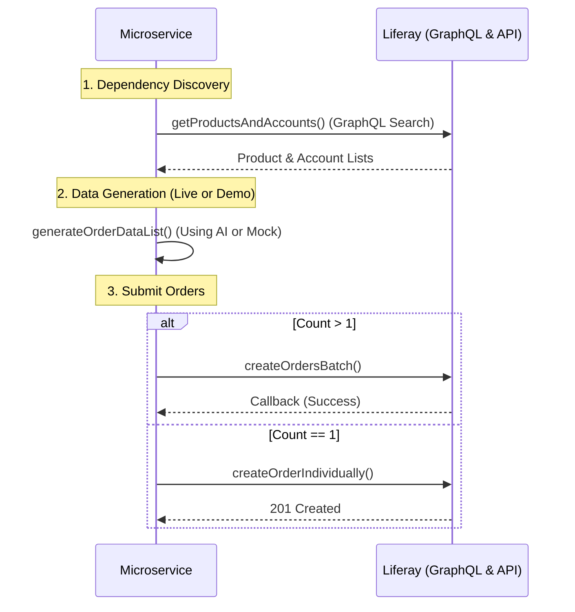

# Microservice Workflow Sequence Diagrams

This document contains sequence diagrams illustrating the primary workflows of the `ai-commerce-accelerator-microservice`.

---

## 1. Generation Workflows

The microservice supports two primary modes for generating data (Products, Accounts, Orders, etc.), depending on the requested count and configuration.

### 1.1 Batch Mode (Count > 1)
Optimized for high-volume generation. Uses Liferay's Batch Engine for asynchronous processing and follows a step-by-step state machine.

### 1.2 Individual Mode (Count = 1)
Used for low-volume requests or when `batchSize` is set to 1. Executes synchronous Headless API calls for immediate feedback.

---

## 2. Live vs. Demo Mode (Data Generation)

This sub-workflow happens at the start of every creation step (e.g., `product-data-generation`).

---

## 3. Deletion Workflows

Deletion is orchestrated by the `DeleteCoordinatorService` to ensure data is removed without violating referential integrity.

### 3.1 Full Environment Deletion (All)
Wipes all data in a hardcoded, safe sequence after performing a global discovery.

### 3.2 Selected Data Deletion
Allows users to target specific categories (e.g., only "Accounts"). Automatically performs discovery first to ensure accurate targeting.

---

## 5. Detailed Entity Sequences

### 5.1 Account Generation Sequence
Handles specialized address establishment (Head Office vs. Billing/Shipping) which requires multiple batch/API loops.

### 5.2 Order Generation Sequence
Depends on existing Products, Accounts, and Warehouses.

