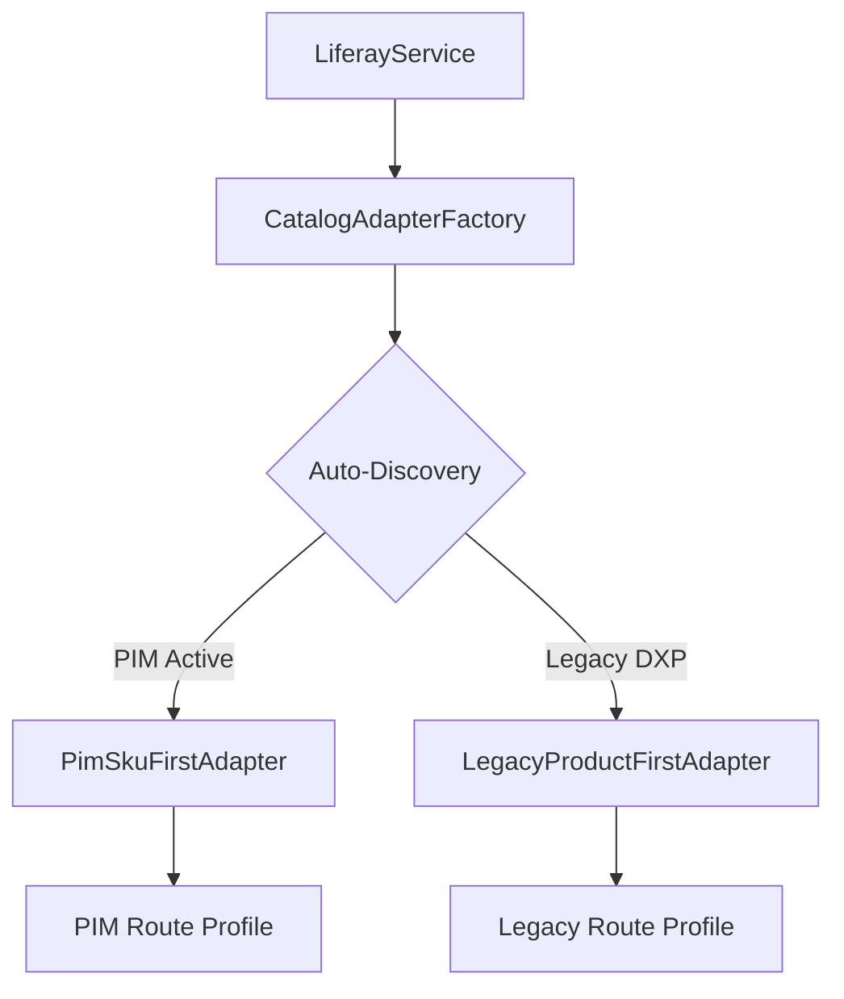

# Sub-Issues Breakdown & Preparatory Roadmap: Liferay PIM Integration

This document contains the detailed breakdown of sub-issues and planning points for the Liferay PIM refactor. These are grouped into **Preparatory Tasks** (which can be implemented immediately before PIM is available) and **PIM Implementation/Verification Tasks**.

---

## Part 1: Preparatory Tasks (Do Ahead of Time)

These tasks restructure the SDK into a flexible, adapter-based system while maintaining 100% compatibility with current Product-first DXP versions.



### Sub-Issue 1: Refactor Path Resolution into Configuration Route Profiles

- **Goal**: Decouple the static URL paths in [liferayPaths.cjs](file:///Volumes/SanDisk/repos/liferay-ai-commerce-accelerator/client-extensions/liferay-accelerator-sdk/src/utils/liferayPaths.cjs) so they can vary based on version profiles.
- **Implementation Steps**:
  1. Create a `profiles/` directory under `liferay-accelerator-sdk/src/utils/`.
  2. Create `profiles/legacyProfile.cjs` containing all current REST endpoints.
  3. Modify `liferayPaths.cjs` to expose a dynamic lookup depending on the active profile configuration.
- **Benefits**: Prepares the codebase for easy configuration switching when new endpoint templates are introduced.

### Sub-Issue 2: Define LiferayCatalogAdapter Interface and Legacy Implementation

- **Goal**: Establish a generic Catalog interface inside the SDK to isolate catalog CRUD operations, and migrate existing REST logic to it.
- **Implementation Steps**:
  1. Define the `LiferayCatalogAdapter` base class/interface.
  2. Implement `LegacyProductFirstAdapter` which subclasses `LiferayCatalogAdapter` and encapsulates all product/SKU calls from [rest.cjs](file:///Volumes/SanDisk/repos/liferay-ai-commerce-accelerator/client-extensions/liferay-accelerator-sdk/src/liferay/rest.cjs).
  3. Update [index.cjs](file:///Volumes/SanDisk/repos/liferay-ai-commerce-accelerator/client-extensions/liferay-accelerator-sdk/src/liferay/index.cjs) to initialize the legacy adapter and delegate all catalog tasks to it.
- **Benefits**: Ensures the adapter pattern is in place and verified under existing test suites.

### Sub-Issue 3: Implement Auto-Discovery Capability Detection Factory

- **Goal**: Enable the SDK to automatically detect which version of Liferay's catalog endpoints is active.
- **Implementation Steps**:
  1. Create `CatalogAdapterFactory`.
  2. Add a startup query to `/o/api` or check platform version headers to detect the presence of the `/o/headless-pim` endpoint.
  3. Fallback to `legacy` if unavailable.
- **Benefits**: Guarantees zero downtime and 100% backward compatibility.

### Sub-Issue 4: Decouple productGenerator and deleteProducts from direct REST endpoints

- **Goal**: Ensure our B2B generation and teardown flows operate strictly through the SDK's abstract methods instead of directly calling lower-level REST routes.
- **Implementation Steps**:
  1. Refactor [productGenerator.cjs](file:///Volumes/SanDisk/repos/liferay-ai-commerce-accelerator/client-extensions/ai-commerce-accelerator-microservice/generators/productGenerator.cjs) to call generic adapter functions rather than specific batch methods (e.g. `createProductSkusBatch`).
  2. Update [deleteProducts.cjs](file:///Volumes/SanDisk/repos/liferay-ai-commerce-accelerator/client-extensions/ai-commerce-accelerator-microservice/services/batch/batch-steps/deleteProducts.cjs) to perform SKU and product deletion via adapter abstraction.

---

## Part 2: PIM Implementation & Verification (Q3/Q4 Phase)

These tasks can be executed once Liferay releases the PIM OpenAPI specifications.

### Sub-Issue 5: Develop PimSkuFirstAdapter (upon OpenAPI specification release)

- **Goal**: Implement the SKU-first tree adapter mapping generic catalog operations to Liferay PIM's tree-based endpoints.
- **Implementation Steps**:
  1. Create `PimSkuFirstAdapter` and `profiles/pimProfile.cjs`.
  2. Map creation tasks: `createProductsBatch` will map to PIM ancestor node creation, and `createSkusBatch` will map to PIM child SKU leaf creation.
  3. Map specification and option linkages to tree nodes.

### Sub-Issue 6: Update AI Generation Prompts & Schemas for Tree Formats

- **Goal**: Refactor the prompt generation and schema files to instruct LLMs to shape B2B data in SKU-first tree formats.
- **Implementation Steps**:
  1. Update `generation-schemas/product.json` to reflect a hierarchical tree shape.
  2. Update prompt templates in [aiService.cjs](file:///Volumes/SanDisk/repos/liferay-ai-commerce-accelerator/client-extensions/ai-commerce-accelerator-microservice/services/aiService.cjs) to instruct the AI to group shared specifications at ancestor levels.

### Sub-Issue 7: End-to-End Test and Validation Suite

- **Goal**: Validate the integrated adapter stack.
- **Implementation Steps**:
  1. Update the Playwright E2E suite to run tests against both a standard Commerce (Product-first) instance and a PIM-enabled instance.
  2. Run the E2E orchestrator:

     ```bash
     bash scripts/run-e2e-ldm.sh -v -k --ci
     ```

---

## Part 3: Deep-Dive Implementation Planning (Technical Specifications)

### A. SDK Catalog Adapter Class Specification (`LiferayCatalogAdapter`)

To ensure clean design patterns, the adapter interface enforces signatures representing the required operations, while wrapping any underlying path variables.

```javascript
class LiferayCatalogAdapter {
  constructor(restService, pathsProfile) {
    this.rest = restService;
    this.paths = pathsProfile;
  }

  // --- Abstract Interface Signatures ---

  async getProducts(config, params) {
    throw new Error('Not Implemented');
  }
  async getProductsByERC(config, ercs, fields) {
    throw new Error('Not Implemented');
  }
  async createProductsBatch(config, items, opts) {
    throw new Error('Not Implemented');
  }
  async deleteProductsBatch(config, opts) {
    throw new Error('Not Implemented');
  }

  async createSkusBatch(config, skusData, opts) {
    throw new Error('Not Implemented');
  }
  async getSkusByERC(config, ercs, fields) {
    throw new Error('Not Implemented');
  }

  async getProductOptions(config, productId) {
    throw new Error('Not Implemented');
  }
  async deleteProductOption(config, productId, optionId) {
    throw new Error('Not Implemented');
  }
  async addProductOptions(config, productId, productOptions, productERC) {
    throw new Error('Not Implemented');
  }

  async getProductSpecifications(config, productId) {
    throw new Error('Not Implemented');
  }
  async deleteProductSpecification(config, productId, specId) {
    throw new Error('Not Implemented');
  }
  async addProductSpecifications(config, productId, specs) {
    throw new Error('Not Implemented');
  }
}
```

### B. Route Profile Registry Implementation

We will replace static path declarations in `liferayPaths.cjs` with a loader that checks the loaded profile.

**1. `src/utils/profiles/legacyProfile.cjs`**:

```javascript
module.exports = {
  PRODUCTS: '/o/headless-commerce-admin-catalog/v1.0/products',
  PRODUCT_SKUS: (productId) =>
    `/o/headless-commerce-admin-catalog/v1.0/products/${productId}/skus`,
  PRODUCT_SKUS_BATCH:
    '/o/headless-commerce-admin-catalog/v1.0/products/skus/batch',
  PRODUCT_OPTIONS: (productId) =>
    `/o/headless-commerce-admin-catalog/v1.0/products/${productId}/productOptions`,
  PRODUCT_SPECIFICATIONS: (productId) =>
    `/o/headless-commerce-admin-catalog/v1.0/products/${productId}/productSpecifications`,
};
```

**2. `src/utils/profiles/pimProfile.cjs`** (Draft):

```javascript
module.exports = {
  PRODUCTS: '/o/headless-pim/v1.0/nodes', // Tree ancestors
  PRODUCT_SKUS: (nodeId) => `/o/headless-pim/v1.0/skus`, // Unified direct endpoint
  PRODUCT_SKUS_BATCH: '/o/headless-pim/v1.0/skus/batch',
  PRODUCT_OPTIONS: (nodeId) => `/o/headless-pim/v1.0/nodes/${nodeId}/options`,
  PRODUCT_SPECIFICATIONS: (nodeId) =>
    `/o/headless-pim/v1.0/nodes/${nodeId}/specifications`,
};
```

### C. Capability Probing Implementation Plan (`CatalogAdapterFactory`)

During initialization, we execute a lightweight `GET` or `OPTIONS` probe to verify the active routes:

```javascript
class CatalogAdapterFactory {
  static async resolveAdapter(restService, config) {
    try {
      // Probe to see if the PIM API root responds
      const response = await restService._rawRequest(config, {
        method: 'OPTIONS',
        url: '/o/headless-pim/v1.0/openapi.json',
      });

      if (response.status === 200) {
        const pimProfile = require('../utils/profiles/pimProfile.cjs');
        const PimSkuFirstAdapter = require('../liferay/adapters/PimSkuFirstAdapter.cjs');
        return new PimSkuFirstAdapter(restService, pimProfile);
      }
    } catch (e) {
      // Silent catch - default to legacy mode
    }

    const legacyProfile = require('../utils/profiles/legacyProfile.cjs');
    const LegacyProductFirstAdapter = require('../liferay/adapters/LegacyProductFirstAdapter.cjs');
    return new LegacyProductFirstAdapter(restService, legacyProfile);
  }
}
```

### D. Generator Control Flow Refactoring Strategy

Currently, [productGenerator.cjs](file:///Volumes/SanDisk/repos/liferay-ai-commerce-accelerator/client-extensions/ai-commerce-accelerator-microservice/generators/productGenerator.cjs) makes sequential batch posts based on a hardcoded step order:

1. `CREATE_PRODUCTS` -> waits for Vulcan response.
2. `LINK_PRODUCT_OPTIONS` -> links option definitions.
3. `CREATE_PRODUCT_SKUS` -> builds variant SKUs with `skuOptions`.

**Refactoring Strategy**:

- Introduce standard **Catalog DTOs** (e.g. `AicaProduct` and `AicaSku` structures) that the generator passes to the adapter.
- In the legacy adapter, `createProductsBatch` and `createSkusBatch` will perform the two separate standard Vulcan requests, simulating the existing step sequence.
- In the PIM adapter, `createProductsBatch` will simply register base parent nodes, and `createSkusBatch` will submit standard SKU items referencing the parent nodes as ancestors, completely skipping the legacy option linking step.

<!-- markdownlint-disable MD049 -->

---

_Last Updated: 2026-07-08_ | _Last Reviewed: 2026-07-08_
